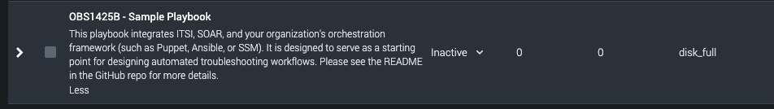

# Splunk .conf23 - OBS1425B - SOARing Towards IT Excellence
## Supplemental materials

## Authors
- Scott Odle <sodle@splunk.com>
- Daniel Pierson <dpierson@splunk.com>

## .conf Talk Recording
https://conf.splunk.com/watch/conf-online.html?search=obs1425b#/

## Example Playbook


This playbook demonstrates the ability of Splunk SOAR to automatically handle a "Disk Full" episode from Splunk ITSI.
It is designed to work with your orchestration layer (for example, Puppet or Ansible) to run commands on the affected host, to troubleshoot the alert condition.

## Importing the playbook
1. Compile the playbook into a tarball, by running:

```bash
make playbook
```

2. In the SOAR UI, select "Playbooks" from the main menu and click the "Import playbook" button.


3. Choose the `build/obs1425b.tgz` file that was generated by the build script, and upload it. Choose the source repo that you want to import it to (probably `local`, if this is a new SOAR instance).


4. Find the newly-imported playbook in the list and open it. You can view this playbook in the Visual Playbook Editor, and adapt it to fit your needs.


